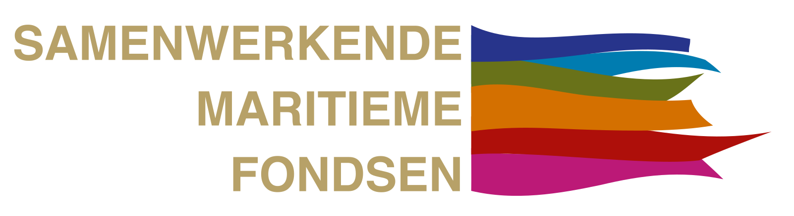
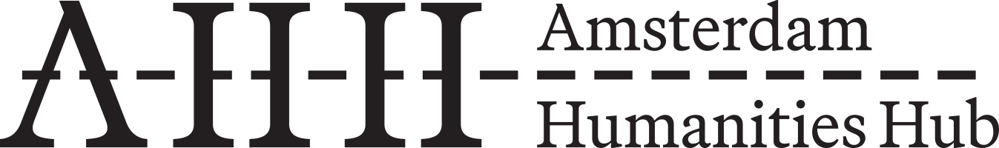
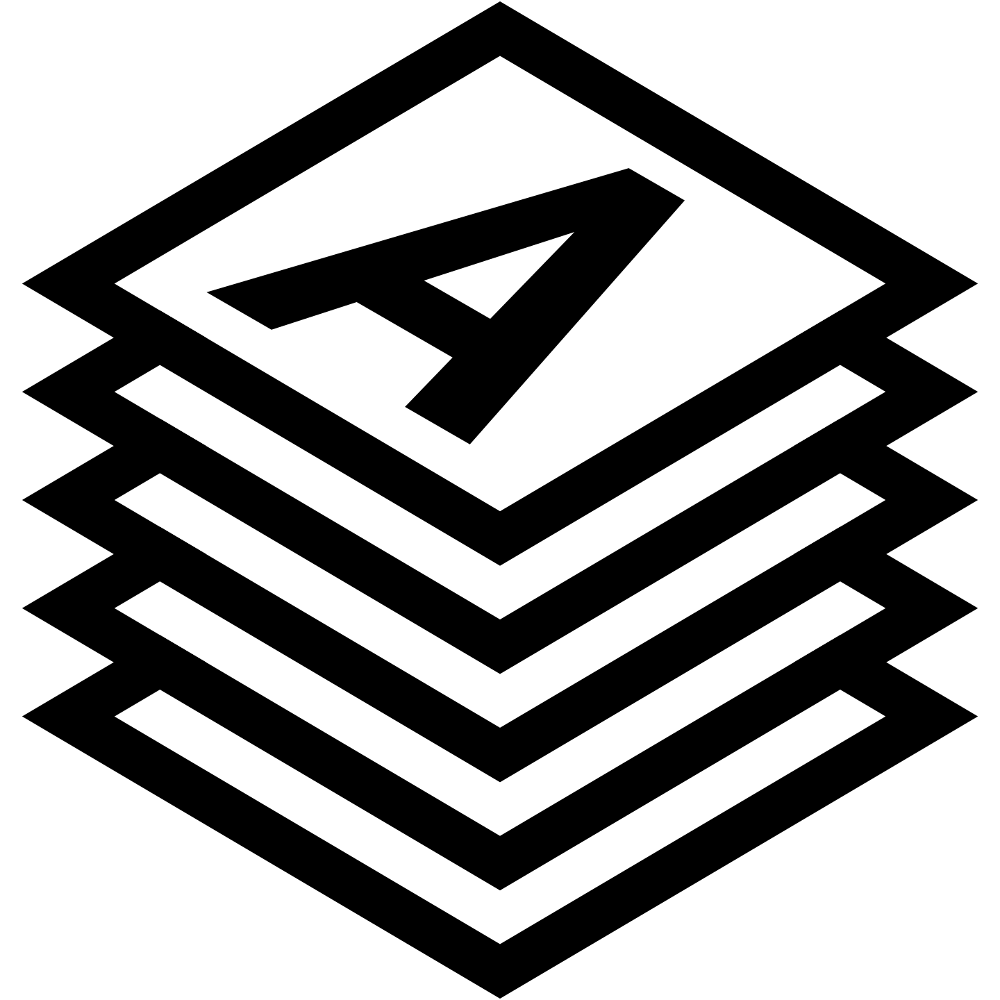

De atlas is ontwikkeld door de Faculteit Geesteswetenschappen van de Universiteit van Amsterdam (UvA) in samenwerking met Allmaps/TU Delft. De inhoud is verzorgd door studenten van de master Militaire geschiedenis en de research master Geschiedenis onder begeleiding van dr. Djoeke van Netten en prof. dr. Floribert Baudet. De ontwikkeling van het open source template is mede mogelijk gemaakt door financiële steun van de Samenwerkende Maritieme Fondsen.

<dl>
  <dt>Concept, coördinatie en begeleiding</dt>
  <dd>Prof. Dr. Floribert Baudet, Dr. Djoeke van Netten, Boudewijn Koopmans (Universiteit van Amsterdam), Jules Schoonman (TU Delft)
  </dd>
  <dt>Teksten en redactie</dt>
  <dd>Jelmer Datema, Mick Höcker, Nina van der Meij en Sean de Graaff, Michel van der Breggen, Wessel Kuperus</dd>
  <dt>Ontwikkeling applicatie</dt>
  <dd>Jules Schoonman, Bert Spaan, Manuel Claeys Bouuaert, Leon van Wissen</dd>
  <dt>Vormgeving</dt>
  <dd>Luuk van de Ven</dd>
  <!-- <dt>Militaire projectie</dt>
  <dd>Studio Grondwerk</dd> -->
</dl>

De Kattenburg Atlas maakt gebruikt van een open source template. Bekijk voor meer informatie de [broncode op GitHub](https://github.com/amsterdamtimemachine/kattenburg-atlas).

<!-- De Kattenburg Atlas is onderdeel van een grotere ambitie om de historie van Kattenburg te ontsluiten via 3D visualisaties, AR/VR applicaties, het verbinden van databronnen over personen, plaatsen en gebeurtenissen, en het vastleggen van persoonlijke verhalen. -->

<!-- Deze website is het resultaat van een samenwerking tussen de Faculteit Geesteswetenschappen van de Universiteit van Amsterdam (UvA) en de TU Delft. Onder begeleiding van Prof. Dr. Floribert Baudet en Dr. Djoeke van Netten van de UvA en digital curator Jules Schoonman van de TU Delft Library hebben zes masterstudenten archiefonderzoek gedaan naar de historie van het eiland Kattenburg; van het prille begin aan het einde van de zestiende eeuw tot de huidige tijd. Het archiefonderzoek in onder meer de beeldbank van het Stadsarchief Amsterdam heeft geleid tot thematische verhalen die gecombineerd zijn met erfgoedmateriaal en historische kaarten die worden ontsloten via het Allmaps platform. Aan de hand van gedigitaliseerde kaarten, foto’s en verhalen kan de bezoeker van deze website een tijdreis maken langs de vele transformaties van Kattenburg. -->

  
  
  
  
   

